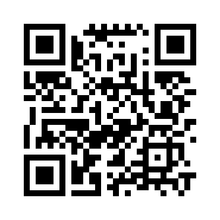

# Barcelona demo runbook (source for the printable guide)

**Event:** show-and-tell, week of 7 September 2026. Audience: children, assembling and running the device themselves.

**Planned sequence** (owner's own words, 31 August 2026): children assemble the physical device → place a reference image (ants) underneath → run a ~1 minute experiment → connect a phone to see it working → remove the SD card, put it in a computer, and see the AI results.

This document is the working source for a one-page PDF a facilitator can follow. It is **not itself the PDF** — see "Producing the PDF" at the bottom.

---

## What's already built vs. what's missing

| Step | Status |
| --- | --- |
| 1. Physical assembly (board, camera, frame) | **Out of scope for this document.** This repository is the *software* side only (see [CLAUDE.md](../CLAUDE.md), [setup-guide.md](setup-guide.md): "The enclosure — Not covered here"). Assembly steps must come from the enclosure subgroup's own materials. Placeholder left below. |
| 2. Place the reference image, power on, run ~1 minute | Built and validated - this is just "collect a session" from [operations.md](operations.md), using the pilot default (retain-every-frame, QXGA, 1 FPS). |
| 3. Connect a phone, see it working | Built - the device-hosted control app ([ADR 0001](adr/0001-device-hosted-control-app.md)). **Confirmed working on Android** (QR scan → auto-join → captive-portal opens the app, no IP address needed). iPhone is untested - not a known bug, just never tried on real hardware. **Recommendation: bring an Android phone as the primary device for this step.** |
| 4. SD card → computer → AI results | Built - `dashboard.html`, fully offline, works in Chrome/Edge/Firefox/Safari. A zero-risk **rehearsal mode** already exists (`install_dashboard_demo.py`) using synthetic data, so this step can be fully practiced beforehand without touching a real card. |

## One important constraint for step 2+3 together

**Wi-Fi and motion-triggered capture cannot run at the same time** - Wi-Fi activity causes a 100% false-trigger rate in motion detection (documented, [device-control-app-plan.md](device-control-app-plan.md)). This is not a problem for the demo: use the **retain-every-frame** mode (the pilot default), which has no motion comparison to disturb. Do not enable "Save pictures only when something moves" for this demo.

## Step-by-step (software side)

### Before the day: prepare the card
1. `py tools\prepare_sd.py <card-root>` on a fresh or wiped FAT32 card (≤32 GB).
2. `py tools\configure_camera_trial.py <card-root> --install-pilot-default` - confirms retain-every-frame QXGA mode, not motion-trigger.
3. Rehearse the AI-review step risk-free first: `py tools\install_dashboard_demo.py <card-root>`, open `<card-root>\demo\demo.html`, run through **Start looking** and **Make my insect movie** so whoever facilitates has done it once already.

### On the day
1. *(Physical assembly - see enclosure subgroup materials.)*
2. Place the reference image under the camera.
3. Connect the battery cable. The device is now capturing.
4. Hand a phone to a child. Scan the InsectCam Wi-Fi QR code below (or join manually: network **InsectCam**, password **antcamera**). The control app should open automatically; if not, browse to `192.168.4.1`.
5. On the control app: **👁️ Take a peek** shows the most recent photo live. Let the pictures accumulate for about a minute.
6. Tap **🏁 Finish my adventure** - this safely stops and unmounts the card. Wait for its confirmation before touching the card.
7. Disconnect the battery cable, remove the SD card, insert it into a computer.
8. Open `dashboard.html` from the card. Show the captured images, then **Find insects with AI** (FlatBug - Quick look is fastest) to show the AI results on the real session just captured.

### The Wi-Fi QR code

`WIFI:S:InsectCam;T:WPA;P:antcamera;;` - standard format, joins directly from the phone's camera app on both Android and iOS. This was flagged as an outstanding gap in [device-control-app-plan.md](device-control-app-plan.md) ("physical sticker... still outstanding") - generated here, needs printing and sticking to the enclosure before the trip.

## Outstanding before this is demo-ready

1. **A real end-to-end rehearsal** of the exact sequence above, timed, on the actual hardware that's travelling to Barcelona - not yet done as of this writing. See "Stability check" below.
2. **Firmware is a normal pilot build** (the white-balance seeding work is finished - see hardware-validation.md). Daylight-confirmed 2 September 2026: a real, visible improvement over the original green/purple casts, but a mild residual purple/mauve tint remains in shadowed areas - not a clean neutral pass. Worth knowing for the demo: photos won't have the old strong cast, but don't expect perfectly neutral colour either.
3. Physical assembly instructions - need to come from the enclosure subgroup, not written here.
4. iPhone path is genuinely untested. If any child is likely to bring an iPhone, worth a quick real test beforehand rather than finding out live.
5. Print the QR code above onto the enclosure.

## Producing the PDF

Plan: author a clean, printable HTML page (not raw Markdown) and render it to PDF locally via `msedge.exe --headless=new --print-to-pdf` (already proven working in this project for the dashboard screenshot check). Not yet built - next step once the items above are resolved enough that the content is stable.
